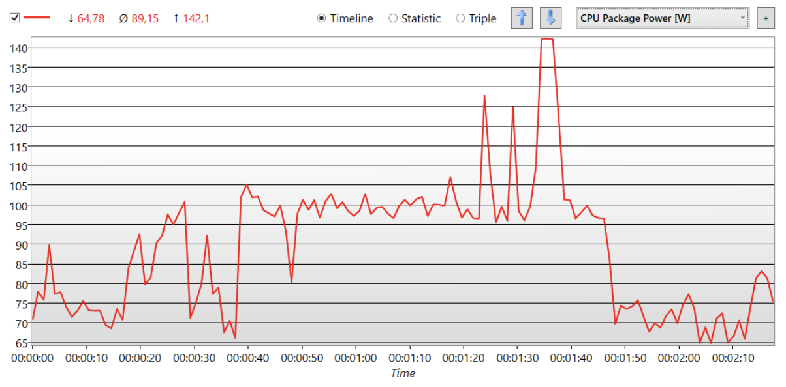

# Resource consumption
<pre>

</pre>
---
###### > [Code of Conduct](CODE_OF_CONDUCT.md)
###### > [Machine Learning Models](ML.md)
###### > [Privacy Notice](PRIVACY_NOTICE.md)
###### > [HOME](index.md)
###### > [Contacts](CONTACTS.md)

<pre>
</pre>

---
---

### Direct resource consumption 

---
---

In the prototype phase, sAIn was trained and evaluated on a system that was not optimized for machine learning. In addition, the model was trained and evaluated on only one CPU; there could be potential for optimization here if it is possible to train the neural network on hardware designed for this purpose. 

<pre>
</pre>

Ideally, the model should be trained on a dedicated server with suitable hardware in a data center. Ideally, this would happen in a Google data center (see sustainable-computing slides), as they have very good greenhouse intensity, PUE, and other important criteria. The training time should be chosen based on the chosen region and the current energy mix of that region. This can be done using the Electricity Map tool.

<pre>
</pre>

---
---

#### Consideration of energy efficiency

sAIn uses ready-made solutions from Google Mediapipe to convert the video input in a camera into a person unrelated format. This allows a much leaner neural network to be used on this abstracted data. 

<pre>
</pre>

With a smaller number of gestures and training data, the model is always trained from scratch. However, as soon as more gestures and data are available, the model is not always trained again, but refined and extended by transfer learning techniques, such as extension of the last layers for new gestures and refinement of the already learned weights.

<pre>
</pre>

---
---

#### Capturing efficiency measures 
We use Tensorboard during training to measure the accuracy of our model.

<pre>
</pre>

###### Below, we measured the power consumption during the execution of sAIn with unoptimized model (CPU Package Power in Watts measured with HWinfo):

<pre>
</pre>

The execution in this scenario had caused a Δ of about 30 watts compared to the "normal" power consumption of the CPU. The 3 spikes at about 1:20 are attributable to Whisper's audio transcription, which caused an additional Δ of 30 to 40 watts.

<pre>
</pre>

---
---

#### Optimization of energy efficiency 
In the prototype phase, quantization methods are not yet used. However, since the neural network was developed using the TensorFlow library, which offers several quantization approaches and model optimizations "out-of-the-box", these will be evaluated and a variation of them will be used later in the development of sAIn. 

<pre>
</pre>

---
---

#### CO₂ footprint, efficiency and emissions offsets
If training occurs in a data center, the training process is CO₂-neutral.

<pre>
</pre>

We suspect that a majority of the emissions will occur at the end-user, since the training process is done rather infrequently. For the emissions that do occur here, the users would have to take care of offsetting themselves.

<pre>
</pre>

---
---

### Indirect resource consumption 

<pre>
</pre>

---
---

#### Sustainable hardware cycle and data centers
Since we plan to run our training process in a Google data center, we can refer to Google's data for this purpose. 
We have very little influence on the final user hardware, computers or smartphones, and their cycles and must appeal to users to inform and decide for themselves.
