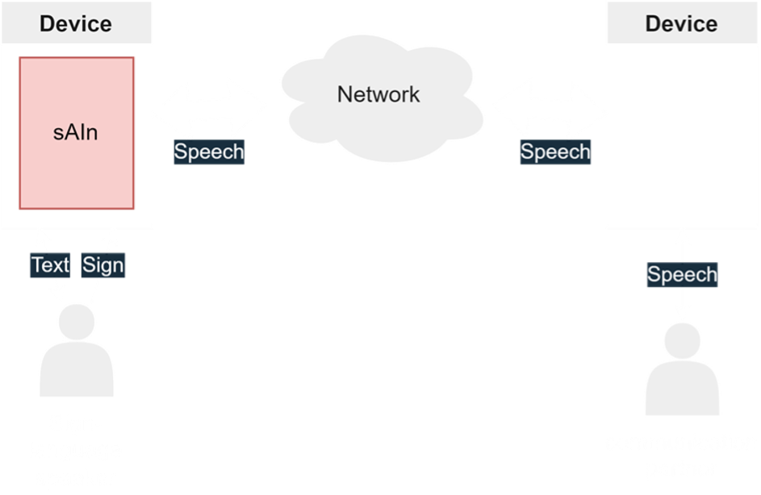
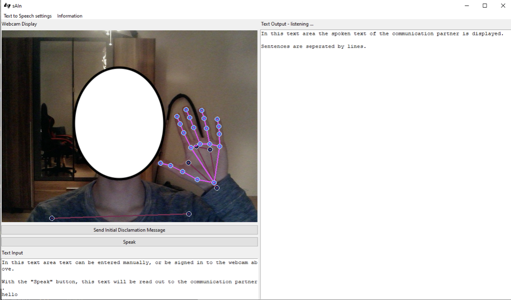
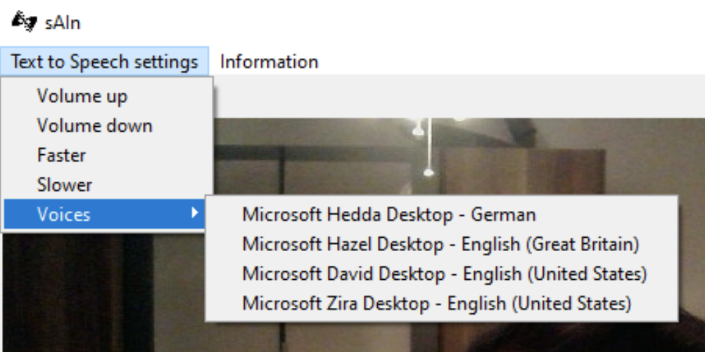
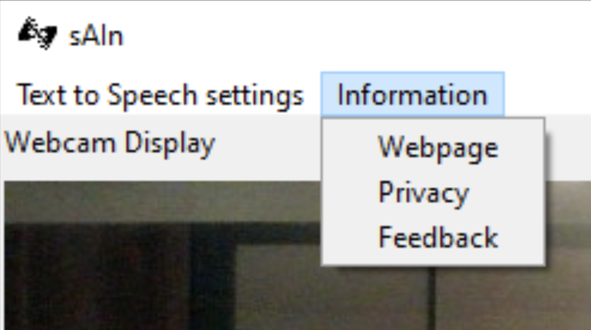
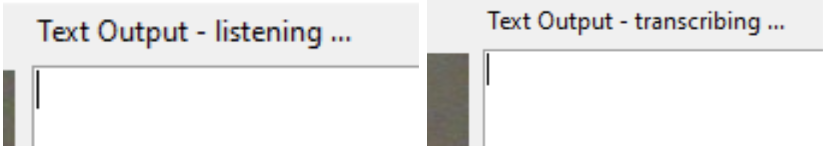

# sAIn

Welcome to the sAIn project webpage! Check out our Repository [here](https://github.com/hm-sAIn/sAIn).
<pre>

</pre>
###### MENU

###### > [Code of Conduct](CODE_OF_CONDUCT.md)
###### > [Privacy Notice](PRIVACY_NOTICE.md)
###### > [Machine Learning Models](ML.md)
###### > [Resource Consumption](RESOURCE_CONSUMPTION.md)
###### > [Contacts](CONTACTS.md)

<pre>
</pre>

Empowering face-to-face conversations between people who communicate through American Sign Language (ASL) and those who speak English by harnessing the power of AI-driven machine translation technology we want everyone to feel included.

<pre>
</pre>

<pre>
</pre>

###### ANYTIME, ANYWHERE:
Providing 24/7 access to fast, affordable ASL translation, our Application is ideal for a broad array of setting.

<pre></pre>
###### PRIVATE AND SECURE:
Conversations are kept private with robust security features, including on-device processing.

<pre></pre>
###### EASY TO USE:
Frustration-free setup means getting started is simple, intuitive, and requires no user training or specialized IT infrastructure.

<pre></pre>
###### EXCEPTIONAL VALUE:
Available open-source, our Application is the affordable alternative to onsite interpreters and video remote interpreting services.

<pre>
</pre>

#### Motivational background

A communication barrier is created between signers and non-signers in everyday life and in audio media. This results in severely limited integration and inclusion opportunities to the disadvantage of the hearing impaired side. That is 466 000 000 people worldwide!
95 % of them have hearing parents and grow up in a hearing family and circle of friends. But only very few of them make sign language their own. Why should they?

<pre></pre>
As a result, hearing-impaired people are excluded from participation in mainstream communication opportunities and from a large proportion of potential communication partners. They remain only in a small and specific circle of people and have to live with the serious limitations in everyday life, professional career and education. Not only the quick exchange with a friend via a phone call is difficult to impossible. Even dialing for a simple emergency call via the telephone network is not possible for a hearing impaired person.

<pre></pre>
However, hearing loss can affect anyone. Even hearing people can lose their hearing in the course of their lives or as a result of an accident. Unlike sign language speakers who have always lived with their disability and learned to get along with it, those affected suddenly find themselves in a completely unfamiliar situation that can often be very stressful.

<pre></pre>
Both parties are confronted with a very upleasant problem for which only meager and partly outdated solutions exist so far.

<pre>
</pre>

#### What we offer

sAIn breaks down these barriers and promotes integration and inclusion of the hearing impaired by providing a communication interface tailored to them. 

<pre></pre>
Through sAIn, conversations of sign language speakers and non-sign language speakers and the transmission of information in audio form to the hearing impaired are made possible by translating used language for the communication partner. 

<pre></pre>

###### This means: 
Sign language or text is converted into spoken language and spoken language or audio is converted into text that can be read by the signer.

<pre>
</pre>

The areas of application are diverse. sAIn generates **added value**, whether in **daily communication**, **professional development**, **health care** or in the **education** of sign language speakers.

<pre>
</pre>

#### How it works

<pre>
</pre>

##### See yourself on your device and get incoming audio as text on your display. Recognized sign language gestures are translated and displayed to you in the according text form.

<pre>
</pre>

###### Customize your experience in the settings!

<pre>
</pre>

###### Have any questions or feedback? Navigate to our information and contact section.

<pre>
</pre>

###### Keep track.

<pre>
</pre>

#### Our vision

**Enabling sAIn to overlay other applications is our next step, extending its application possibilities and increasing its generated value.**
 